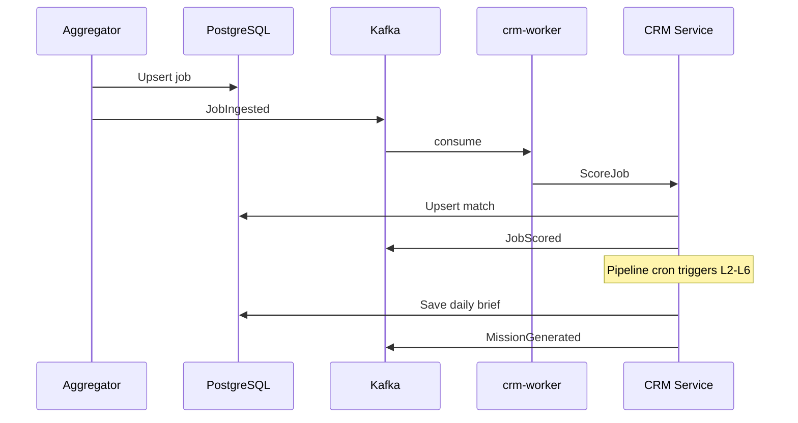

# Career OS — Product Requirements & Architecture

> **Personal AI recruiter for Senior Backend Engineers targeting $150k+ remote roles.**

This is **not** a job board, ATS, or resume builder. It is a **Career Operating System** that answers one question every day:

**"What should I do today?"**

---

## 1. Product Requirements Document (PRD)

### 1.1 Problem

Senior engineers waste 10–20 hours/week on low-ROI job search activities: manual browsing, unfocused applications, generic outreach, and reactive interview prep. The market is noisy; signal is buried in volume.

### 1.2 Solution

Career OS acts as a **personal recruiter + coach + strategist** that:

| Role | What it does |
|------|----------------|
| Recruiter | Finds, ranks, and selects jobs worth applying to |
| Coach | Identifies skill gaps with highest ROI |
| Strategist | Prioritizes companies and outreach targets |
| Interview mentor | Generates daily practice questions aligned to targets |
| Accountability partner | Syncs daily missions to the task tracker |

### 1.3 Success Metrics

| Metric | Target (90 days) |
|--------|-------------------|
| Daily active usage | ≥ 5 min/day, 5 days/week |
| Application quality | Fit score ≥ 75 on 80% of applications |
| Response rate | ≥ 15% (industry avg ~8%) |
| Interview rate | ≥ 8% of applications |
| Time to first interview | ≤ 21 days from first sync |

### 1.4 Non-Goals (V1)

- Multi-user SaaS / auth
- LinkedIn automation (ToS risk)
- Auto-apply bots
- Resume PDF generation
- Social network features

### 1.5 Core User Journey

```
Morning → Open /crm → See Today's Mission (30 min)
       → Apply to 1 job → DM 2 people → Study 1 skill → Practice 1 question
       → Mark complete → Weekly review on Sunday
```

### 1.6 Product Principles

1. **Action over analytics** — every screen drives the next step
2. **Decision elimination** — system chooses, user executes
3. **Minimal daily effort** — default mission ≤ 30 minutes
4. **Quality over volume** — 1 great application beats 10 spray-and-pray
5. **Compound intelligence** — each layer feeds the next via events

---

## 2. Domain-Driven Design

### 2.1 Bounded Contexts

```
┌─────────────────────────────────────────────────────────────────┐
│                     Career OS (CRM Context)                      │
├──────────────┬──────────────┬──────────────┬────────────────────┤
│ Job Intel    │ Career Intel │ Skill Gap    │ Interview Ready    │
│ (L1)         │ (L2)         │ (L3)         │ (L4)               │
├──────────────┴──────────────┴──────────────┴────────────────────┤
│ Offer Prediction (L5)  │  Daily Mission (L6)  │  Outreach        │
├────────────────────────┴──────────────────────┴──────────────────┤
│ Shared Kernel: UserProfile, Company, JobPosting, Application     │
└─────────────────────────────────────────────────────────────────┘
         │ events (Kafka)
         ▼
┌─────────────────────────────────────────────────────────────────┐
│              Accountability Context (Task Tracker)               │
│  tasks · daily_reviews · weekly_reviews · metrics                │
└─────────────────────────────────────────────────────────────────┘
```

### 2.2 Aggregates

| Aggregate | Root Entity | Invariants |
|-----------|-------------|------------|
| **JobPipeline** | `JobPosting` | Unique (source, external_id); must be scored before mission selection |
| **ApplicationPipeline** | `Application` | Valid status transitions; one active application per job |
| **UserCareerProfile** | `UserProfile` | Skills 1–10; min salary; remote preference |
| **DailyMission** | `DailyBrief` | One per calendar day; immutable once generated (regenerate overwrites) |
| **MarketIntelligence** | `MarketSnapshot` | One snapshot per day; derived from active jobs |
| **InterviewReadiness** | `InterviewReadiness` | One row per target company |

### 2.3 Domain Events

| Event | Trigger | Consumers |
|-------|---------|-----------|
| `JobIngested` | New job upserted | Job Intel (score) |
| `JobScored` | Match persisted | Career Intel, Skill Gap |
| `ApplicationChanged` | Status update | Offer Prediction |
| `DailyMissionGenerated` | Brief saved | Task Tracker sync |
| `WeeklyReviewGenerated` | Report saved | Coach UI |

### 2.4 Ubiquitous Language

| Term | Definition |
|------|------------|
| **Fit Score** | 0–100 composite job suitability |
| **Gap Score** | 0–100 learning priority (demand × level deficit) |
| **Mission** | Today's 4 actions + time budget |
| **Target Company** | Company in interview readiness watchlist |
| **Bottleneck** | Primary constraint on interview/offer probability |

---

## 3. System Architecture

```
                    ┌──────────────┐
                    │  Next.js UI  │  /crm/*
                    └──────┬───────┘
                           │ REST
                    ┌──────▼───────┐
                    │  Go Server   │  :8082
                    │  cmd/server  │
                    └──────┬───────┘
           ┌───────────────┼───────────────┐
           │               │               │
    ┌──────▼──────┐ ┌──────▼──────┐ ┌──────▼──────┐
    │ PostgreSQL  │ │   Kafka     │ │  OpenAI     │
    │  jobhunt    │ │  Redpanda   │ │  (optional) │
    └─────────────┘ └──────┬──────┘ └─────────────┘
                           │
                    ┌──────▼───────┐
                    │ crm-worker   │
                    │ async score  │
                    └──────────────┘
```

### Intelligence Layer Pipeline (daily cron + manual sync)

```
Collect → Score → Market Intel → Skill Gap → Interview Ready
                                              → Offer Predict → Daily Mission
```

---

## 4. Layer Specifications

### Layer 1 — Job Intelligence Engine

**Input:** Raw jobs from 8 sources  
**Output:** Normalized `JobPosting` + `JobMatch` with fit/pros/risks

**Scoring formula (heuristic baseline):**

```
fit = skill×35 + remote×15 + salary×15 + seniority×10 + web3×10 + company×10 + growth×5
```

**Company quality heuristics:** known infra brands, funding stage signals, engineering blog presence  
**Growth heuristics:** senior/staff titles, platform/infrastructure keywords

### Layer 2 — Career Intelligence Engine

**Input:** All active scored jobs  
**Output:** `MarketSnapshot` — skill demand %, trending tech, interview topics

### Layer 3 — Skill Gap Engine

**Input:** `user_skills` (levels 1–10) + market demand  
**Output:** Top 3 skills ranked by gap score

```
gap_score = demand_pct × (10 - user_level) / 10 × 100
roi = gap_score × sqrt(demand_pct)
```

### Layer 4 — Interview Readiness Engine

**Input:** Target companies + user skills + job descriptions mentioning company  
**Output:** Per-company readiness score, missing topics, study plan

**Default targets:** Grafana Labs, Confluent, GitLab, Cloudflare, Chainlink, Alchemy, Nethermind

### Layer 5 — Offer Prediction Engine

**Input:** Application funnel stats  
**Output:** Interview/offer probability, bottleneck diagnosis

**Heuristic model (MVP):**

```
interview_prob = min(95, response_rate × 1.5 + avg_fit × 0.3)
offer_prob = interview_prob × 0.25
```

**Bottleneck rules:**
- response_rate < 10% → Resume or targeting issue
- avg_fit < 70 → Target company issue
- outreach < 5/week → Low outreach volume
- top gap > 80 → Skill gap issue

### Layer 6 — Daily Mission Generator

**Input:** All layer outputs  
**Output:** `DailyBrief` with apply, outreach×2, learning, interview question, 30 min budget

---

## 5. Event-Driven Architecture

### Kafka Topics

| Topic | Key | Payload |
|-------|-----|---------|
| `crm.jobs.ingested` | job_id | `{job_id, event, timestamp}` |
| `crm.jobs.scored` | job_id | `{job_id, fit_score, timestamp}` |
| `crm.application.changed` | app_id | `{application_id, status, timestamp}` |
| `crm.mission.generated` | date | `{brief_date, apply_job_id, timestamp}` |

### Event Flow



---

## 6. API Design

Base: `/api/v1/crm`

| Method | Path | Layer | Description |
|--------|------|-------|-------------|
| GET | `/dashboard` | L6 | Today's mission |
| POST | `/pipeline/run` | ALL | Full daily pipeline |
| GET | `/jobs` | L1 | Ranked jobs |
| GET | `/market/trends` | L2 | Market intelligence |
| GET | `/skills` | L3 | Skill gaps with levels |
| GET/PUT | `/skills/levels` | L3 | User skill graph |
| GET | `/interview/readiness` | L4 | Company readiness |
| GET | `/offers/predictions` | L5 | Funnel + bottlenecks |
| POST | `/jobs/:id/resume` | — | Resume analyzer |
| GET | `/weekly` | — | Weekly review |
| GET | `/coach` | — | Coach recommendations |

---

## 7. Frontend Architecture

```
frontend/
├── app/
│   ├── page.tsx          # Today (L6) — primary screen
│   ├── jobs/             # L1 ranked list
│   ├── market/           # L2 trends (minimal bars, no chart overload)
│   ├── skills/           # L3 gap + levels
│   ├── interview/        # L4 readiness
│   ├── applications/     # Pipeline
│   ├── outreach/         # Outreach engine
│   └── coach/            # Weekly review
├── components/
│   ├── mission-card.tsx  # Reusable action card
│   └── ui/               # shadcn-style primitives
└── lib/api.ts            # Typed API client
```

**Design system:** Dark-first, Linear-inspired. Typography-led hierarchy. One primary CTA per screen.

---

## 8. Folder Structure (Backend)

```
internal/crm/
├── aggregator/       # L1 collection
├── matcher/          # L1 scoring
├── engine/
│   ├── market/       # L2
│   ├── skillgap/     # L3
│   ├── interview/    # L4
│   ├── offer/        # L5
│   └── mission/      # L6
├── ai/               # OpenAI client
├── kafka/            # Event bus
├── model/            # Domain types
├── repository/       # Persistence
└── service/          # Orchestrator
```

---

## 9. PostgreSQL Schema (Career OS Extensions)

See `migrations/career_os.sql`:

| Table | Purpose |
|-------|---------|
| `user_skills` | Skill name + level (1–10) |
| `market_snapshots` | Daily demand percentages |
| `company_profiles` | Quality score, interview topics |
| `interview_readiness` | Per-company readiness |
| `offer_predictions` | Daily funnel predictions |
| `daily_briefs` + columns | interview_topic, estimated_minutes |

Extended `job_matches`: `company_score`, `growth_score`

---

## 10. Development Roadmap

### Phase 0 — Foundation (Done)
- [x] Unified DB + server
- [x] Job aggregation (7 sources)
- [x] Basic scoring + daily brief
- [x] Next.js CRM UI

### Phase 1 — Career OS MVP (Current)
- [ ] Six intelligence engines (heuristic + optional AI)
- [ ] Extended schema + migration
- [ ] Market + Interview + Offer API routes
- [ ] Today page: interview question + time budget
- [ ] Skill levels with gap ROI

### Phase 2 — Intelligence Depth
- [ ] OpenAI enrichment for all layers
- [ ] LinkedIn job ingestion (manual export fallback)
- [ ] Contact discovery + outreach persistence
- [ ] Task tracker mission sync
- [ ] Redis cache for dashboard

### Phase 3 — Production Hardening
- [ ] Auth (single-user token)
- [ ] Observability (metrics, tracing)
- [ ] Rate limiting on collectors
- [ ] A/B scoring model tuning

---

## 11. MVP Scope

**Ship in 2 weeks:**

| Feature | Included |
|---------|----------|
| Daily mission (apply + outreach + learn + interview Q) | ✅ |
| Job scoring with company/growth dimensions | ✅ |
| Market skill demand % | ✅ |
| Skill gap with user levels + top 3 | ✅ |
| Interview readiness for 7 target companies | ✅ |
| Offer bottleneck diagnosis | ✅ |
| Weekly review | ✅ (existing) |
| Resume analyzer API | ✅ (existing, no UI) |

**Excluded from MVP:**

- Redis cache
- Task tracker auto-sync
- LinkedIn live scraping
- ML offer model
- Mobile app

---

## 12. V2 Scope

- OpenAI-powered scoring, outreach, interview questions
- Resume analyzer UI with ATS keyword highlighting
- Profile editor (skills, levels, resume paste)
- Contact CRUD + LinkedIn URL tracking
- Task tracker bridge (auto-create daily tasks)
- Email/Slack morning digest
- Application follow-up reminders

---

## 13. V3 Scope

- Bayesian offer prediction from historical funnel
- Company research agent (Glassdoor, Blind signals)
- Mock interview mode (AI interviewer)
- Compensation negotiation coach
- Network graph (who knows whom)
- Multi-profile support (Web3 vs Infra tracks)

---

## 14. Assumptions Challenged & Improvements

| Original assumption | Challenge | Improvement |
|--------------------|-----------|-------------|
| 8 job sources day 1 | LinkedIn ToS blocks scraping | MVP: 7 API sources + manual LinkedIn bookmarklet (V2) |
| Kafka required | Overkill for single user | Kafka optional; sync fallback always works |
| Redis in stack | Adds ops burden | Defer to V2; PostgreSQL + brief cache sufficient |
| Separate Gin server | Already unified Go server | Keep monolith — simpler deploy |
| Heavy analytics dashboard | Violates action-first principle | Market page shows top 8 skills only |
| User sets skill levels manually | Friction | Seed defaults from profile; editable in V2 |
| 30 min daily budget fixed | Some days differ | Configurable in profile (V2) |

---

## 15. Kafka Event Definitions (JSON Schema)

### crm.jobs.ingested
```json
{
  "job_id": "uuid",
  "event": "ingested",
  "source": "remoteok",
  "timestamp": "2026-06-08T07:00:00Z"
}
```

### crm.jobs.scored
```json
{
  "job_id": "uuid",
  "event": "scored",
  "fit_score": 82,
  "timestamp": "2026-06-08T07:00:01Z"
}
```

### crm.application.changed
```json
{
  "application_id": "uuid",
  "job_id": "uuid",
  "status": "interview",
  "timestamp": "2026-06-08T12:00:00Z"
}
```

### crm.mission.generated
```json
{
  "brief_date": "2026-06-08",
  "apply_job_id": "uuid",
  "estimated_minutes": 30,
  "timestamp": "2026-06-08T07:05:00Z"
}
```

---

*Document version: 1.0 — Career OS integrated into jobHuntTask monolith.*
